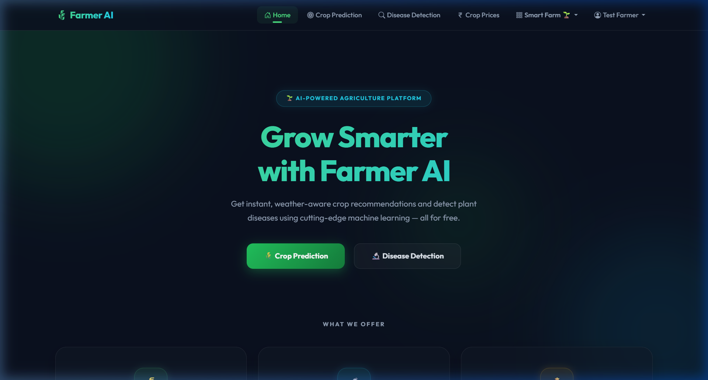
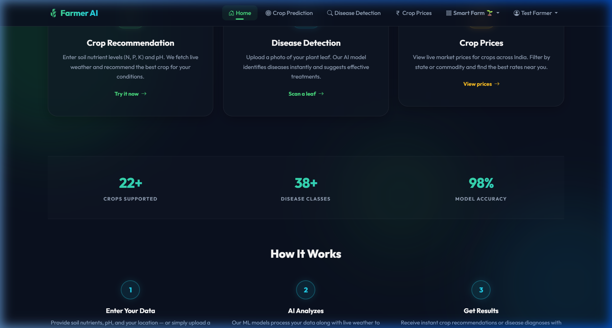
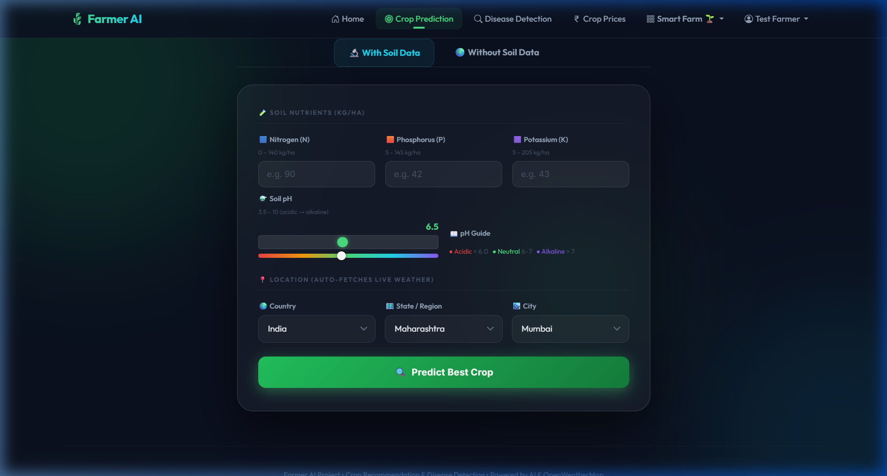
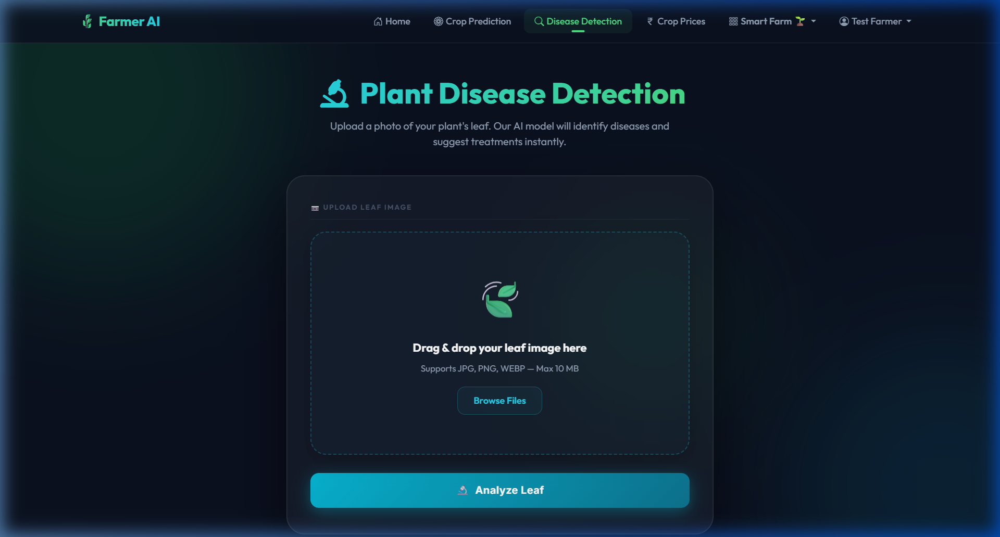
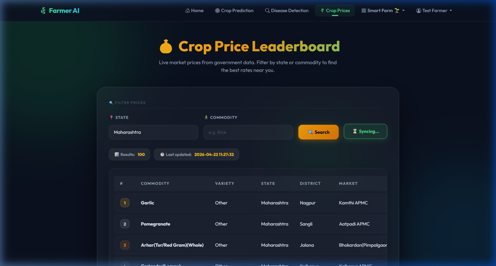
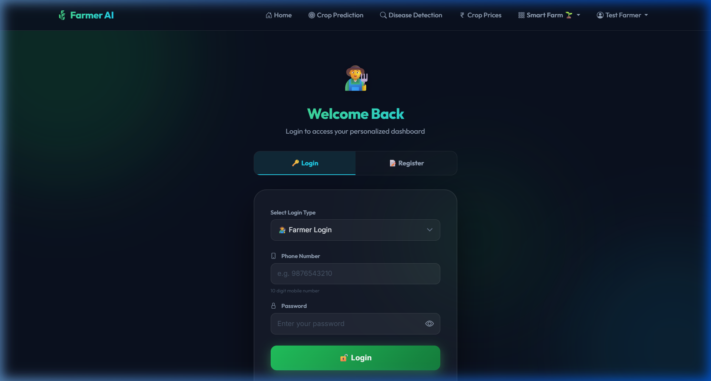
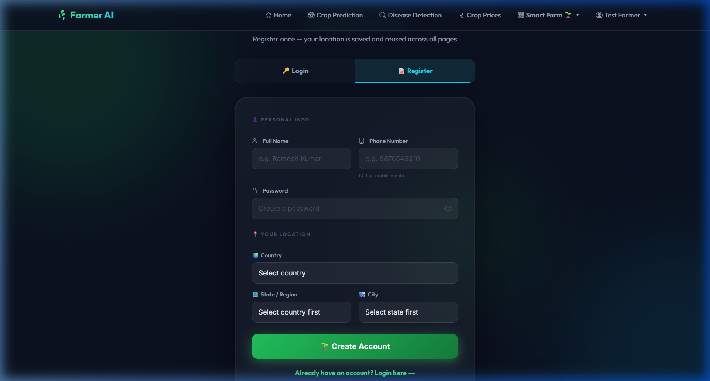

<div align="center">

# 🌾 Farmer AI — Smart Agriculture Platform

### AI-Powered Crop Recommendation · Plant Disease Detection · Smart Farm Management

[](https://python.org)
[](https://flask.palletsprojects.com/)
[](https://tensorflow.org)
[](https://getbootstrap.com/)
[](LICENSE)

<br/>



<br/>

**Farmer AI** is a full-stack intelligent agriculture platform that combines machine learning, live weather data, and ICAR-certified agronomic rules to help farmers make smarter decisions — from choosing the right crop to detecting plant diseases to managing irrigation schedules.

<br/>

[🌱 Features](#-features) · [📸 Screenshots](#-screenshots) · [🚀 Quick Start](#-quick-start) · [🏗️ Architecture](#%EF%B8%8F-architecture) · [📡 API Reference](#-api-reference) · [🤝 Contributing](#-contributing)

</div>

---

## ✨ Features

### 🌾 AI Crop Recommendation
- Enter soil nutrient data (N, P, K, pH) and your location
- Automatically fetches **live weather** (temperature, humidity, rainfall) via OpenWeatherMap
- Trained **Random Forest model** analyzes 7 features to recommend the best crop
- Supports **22+ crops** with 98% model accuracy
- **Robust mode**: No soil data? Get recommendations using just location, season & soil type

### 🔬 Plant Disease Detection
- Upload a leaf photo — AI identifies **38+ disease classes** instantly
- Powered by an **ONNX ensemble deep learning model** (18.5 MB)
- Uses **Google Gemini AI** for detailed treatment suggestions
- Supports drag-and-drop file uploads with live image preview

### 💰 Live Crop Market Prices
- Fetches real-time prices from **data.gov.in** Open Government API
- Filter by state, commodity, or market
- Displays modal price, min/max prices across Indian markets
- Auto-syncs price data with intelligent caching

### 🌱 Smart Farm Dashboard (Phase 5)
- **Farm Setup** — Register your crop, soil type, planting date, and field area
- **Irrigation Alerts** — Dynamic Kc-based water need calculations using real crop coefficients
- **Fertilizer & Soil** — ICAR-certified NPK recommendations by crop + growth stage
- **Farm Health (NDVI)** — Simulated crop growth curves from planting date to harvest
- **Activity Feedback** — Logs farmer actions and adjusts future recommendations
- **Email Alerts** — SMTP-based email notifications for irrigation schedules

### 🛡️ Admin Command Center
- View all registered users, prediction logs, disease scan history
- Monitor platform statistics and user activity
- Delete user accounts and manage the entire system

### 🔐 Authentication System
- Farmer login/registration with phone number + password
- Admin login with separate credentials
- Session-based authentication with secure cookies

---

## 📸 Screenshots

<div align="center">

### 🏠 Homepage

<br/><br/>


---

### 🌾 Crop Prediction


---

### 🔬 Disease Detection


---

### 💰 Crop Prices


---

### 🔐 Login & Register
<table>
<tr>
<td></td>
<td></td>
</tr>
</table>

</div>

---

## 🚀 Quick Start

### Prerequisites

- **Python 3.10+**
- **pip** (Python package manager)
- **Git**

### 1. Clone the Repository

```bash
git clone https://github.com/qsum99/kisanova_ai.git
cd kisanova_ai
```

### 2. Install Dependencies

```bash
pip install -r requirements.txt
```

> Additional packages you may need:
> ```bash
> pip install scikit-learn onnxruntime Pillow
> ```

### 3. Configure Environment Variables

Create a `.env` file in the project root:

```env
# Required — Weather data for crop predictions
OPENWEATHER_API_KEY=your_openweathermap_api_key

# Required — Disease treatment suggestions
GEMINI_API_KEY=your_google_gemini_api_key

# Required — Live crop market prices
GOV_API_KEY=your_data_gov_in_api_key

# Optional — Smart Farm email alerts
SMTP_EMAIL=your_email@gmail.com
SMTP_PASSWORD=your_app_password
SMTP_HOST=smtp.gmail.com
SMTP_PORT=587
```

**Get your free API keys:**
| Service | Free Tier | Get Key |
|---------|-----------|---------|
| OpenWeatherMap | 1,000 calls/day | [openweathermap.org](https://openweathermap.org/api) |
| Google Gemini | Free tier available | [ai.google.dev](https://ai.google.dev/) |
| data.gov.in | Unlimited | [data.gov.in](https://data.gov.in/ogpl_apis) |

### 4. Run the Application

```bash
python app.py
```

The application will start at **http://127.0.0.1:5000** 🎉

---

## 🏗️ Architecture

```
farmer-ai-project/
├── app.py                          # Flask application entry point
├── requirements.txt                # Python dependencies
├── icar_rules.json                 # ICAR-certified fertilizer NPK rules
├── .env                            # API keys & credentials (not committed)
│
├── app/
│   ├── __init__.py                 # Flask app factory & blueprint registration
│   ├── config.py                   # Configuration loader
│   │
│   ├── models/                     # Pre-trained ML models
│   │   ├── crop recommedation.pkl  # Random Forest crop classifier
│   │   ├── ensemble_model_final.onnx  # CNN disease detection model
│   │   └── yield_model.pkl         # Crop yield prediction model
│   │
│   ├── routes/                     # API & page route handlers
│   │   ├── auth_routes.py          # Login, register, logout
│   │   ├── crop_routes.py          # Crop prediction API
│   │   ├── disease_routes.py       # Disease detection API
│   │   ├── price_routes.py         # Market price API
│   │   ├── robust_routes.py        # Location-only crop prediction
│   │   └── phase5_routes.py        # Smart Farm (irrigation, fertilizer, NDVI, admin)
│   │
│   ├── services/                   # Business logic layer
│   │   ├── weather_service.py      # OpenWeatherMap integration
│   │   ├── model_service.py        # ML model loading & inference
│   │   ├── disease_service.py      # Image preprocessing & ONNX inference
│   │   ├── gemini_service.py       # Google Gemini AI integration
│   │   ├── market_price_service.py # data.gov.in price fetching
│   │   ├── auth_service.py         # User authentication logic
│   │   ├── smart_farm_service.py   # Irrigation, fertilizer, NDVI engine
│   │   └── cache_service.py        # In-memory TTL cache
│   │
│   └── utils/
│       └── database.py             # SQLite database schema & helpers
│
├── frontend/
│   ├── static/
│   │   └── style.css               # Global glassmorphism design system
│   │
│   └── templates/                  # Jinja2 HTML templates
│       ├── base.html               # Master layout (navbar, footer, orbs)
│       ├── index.html              # Homepage
│       ├── crop_prediction.html    # Crop recommendation page
│       ├── disease_detection.html  # Leaf disease scanner
│       ├── crop_prices.html        # Market prices dashboard
│       ├── login.html              # Farmer & admin login
│       ├── register.html           # Farmer registration
│       ├── farm_setup.html         # Smart Farm onboarding
│       ├── irrigation.html         # Irrigation alerts dashboard
│       ├── fertilizer.html         # Fertilizer recommendations
│       ├── farm_health.html        # NDVI growth monitoring
│       └── admin_phase5.html       # Admin command center
│
├── database/
│   └── phase5_schema.sql           # Database migration scripts
│
├── datasets/                       # Training datasets
├── notebooks/                      # Jupyter notebooks for model training
└── training/                       # Model training scripts
```

---

## 🧠 Machine Learning Models

| Model | Type | Format | Size | Purpose |
|-------|------|--------|------|---------|
| Crop Recommendation | Random Forest Classifier | `.pkl` | 10.8 MB | Predicts best crop from soil + weather features |
| Disease Detection | CNN Ensemble | `.onnx` | 18.5 MB | Classifies 38+ plant diseases from leaf images |
| Yield Prediction | Regression | `.pkl` | 3.2 MB | Estimates crop yield for robust mode |

---

## 📡 API Reference

### Crop Prediction
```
POST /api/predict
Body: { "N": 90, "P": 42, "K": 43, "pH": 6.5, "city": "Mumbai", "country_code": "IN", "state_code": "MH" }
Response: { "crop": "rice", "temperature": 27.5, "humidity": 80, "rainfall": 150 }
```

### Disease Detection
```
POST /api/detect-disease
Body: FormData with "file" (image)
Response: { "disease": "Tomato Late Blight", "confidence": 0.95, "treatment": "..." }
```

### Market Prices
```
GET /api/prices?state=Maharashtra&commodity=Rice
Response: { "records": [...], "total": 50 }
```

### Smart Farm
```
GET  /api/phase5/irrigation      # Get irrigation recommendations
GET  /api/phase5/fertilizer      # Get fertilizer plan
GET  /api/phase5/ndvi-history    # Get crop growth NDVI data
POST /api/phase5/farm-setup      # Register farm details
POST /api/phase5/log-activity    # Log farming actions
```

---

## 🛠️ Tech Stack

<div align="center">

| Layer | Technology |
|-------|-----------|
| **Backend** | Python 3.10+, Flask 2.3 |
| **ML / AI** | scikit-learn, ONNX Runtime, Google Gemini |
| **Frontend** | HTML5, CSS3, JavaScript, Bootstrap 5.3 |
| **Design** | Glassmorphism, Outfit + Inter fonts, custom CSS |
| **Database** | SQLite (zero-config, file-based) |
| **APIs** | OpenWeatherMap, data.gov.in, SoilGrids |
| **Auth** | Session-based with hashed passwords |
| **Email** | SMTP (Gmail App Passwords) |

</div>

---

## 🌍 External APIs Used

| API | Purpose | Required |
|-----|---------|----------|
| [OpenWeatherMap](https://openweathermap.org/) | Live weather data (temp, humidity, rainfall) | ✅ Yes |
| [Google Gemini](https://ai.google.dev/) | AI-generated disease treatment text | ✅ Yes |
| [data.gov.in](https://data.gov.in/) | Government crop market prices | ✅ Yes |
| [SoilGrids](https://soilgrids.org/) | Soil property lookup by coordinates | ❌ Optional |
| [CountriesNow](https://countriesnow.space/) | Country/State/City dropdowns | ❌ Optional |

---

## 🤝 Contributing

Contributions are welcome! Here's how:

1. **Fork** the repository
2. **Create** your feature branch: `git checkout -b feature/amazing-feature`
3. **Commit** your changes: `git commit -m "Add amazing feature"`
4. **Push** to the branch: `git push origin feature/amazing-feature`
5. **Open** a Pull Request

---

## 📄 License

This project is licensed under the **MIT License** — see the [LICENSE](LICENSE) file for details.

---

<div align="center">

### Made with 💚 by Someshwar Kumbar

🌾 **Farmer AI** — *Empowering farmers with artificial intelligence*

[](https://github.com/qsum99)

</div>
